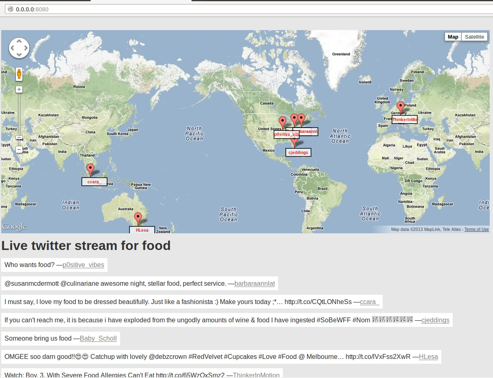

##Live Twitter - live stream of food tweet on google map

This is an experiment with twitter live stream. 

It shows the last 10 locations on google map too.

It uses gevent-socketio to push data to the client from the server.

##Installation

1. create a virtual environment folder next to README.md. Let's call it venv:
virtualenv venv

2. Install Python 2.7 if you don't have it.
in Ubuntu:
sudo apt-get intall python

3. apt-get install libevent-dev

4. activate the virtual environment
source venv/bin/activate

5. Install the following:
pip install gevent-socketio httplib2 oauth2 twitter

6. Make a twitter app online:
Go to http://dev.twitter.com
Sign in
Go to username>applications
Create a new one

7. modify twitterstream/serve.py to have your Twitter app settings:
consumer_key = ""
consumer_secret = ""
access_key = ""
access_secret = ""

7. Run serve.py in the shell

8. open your browser and go to: http://0.0.0.0:8080/

It is tested on Ubuntu 12.04
Check the requirements.txt for further details.

Cheers,
Eras
